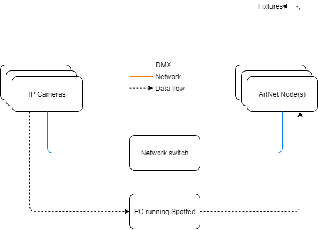

# Spotted


Spotted is a vision based automated followspot, focused on live events. It takes
the feed from multiple IP cameras, and outputs data to fixtures spaced around a
room to keep subjects in the room in the spotlight.

This is the primary deliverable for a university final year project

## Behaviour

When correctly calibrated, the system will track both moving and static objects
in a defined space.

The world origin is defined as the left-most, back-most, lowest point in the
room, from a point of view. The point of view itself does not matter, but every
other measurement is relative to this point. Axis follows the graphical standard
with x being horizontal, y being vertical, and z being depth

## Hardware requirements

- At least two PoE cameras broadcasting the RTSP protocol
- An existing ArtNet network
- A multi-threaded CPU is required for system stability, ideally one thread per
two cameras in the system



## Configuring

### System

The system is configured through JSON, as a single object with the following
keys

#### artnet

Address of the ArtNet node to unicast transmit to. Broadcast and multiple nodes
will be supported in future

#### calibration

Undistort maps from OpenCV to remove the effect of camera lenses

#### room

Cube dimensions for the room representing the space to followspot in. Must be
large enough to contain all fixtures and cameras

#### cameras

JSON array containing the camera definitions

##### id

Camera identifier

##### url

RTSP endpoint for the camera

##### position

Position of the camera in the room space as an object, with x, y and z as keys

##### rotation

Rotation about the standard axis as an object, with x, y and z as keys. Rotation
is applied in the order y-x-z

##### viewing_angle

Viewing angle of the camera, in horizontal and vertical keys

##### resolution

Raw resolution input from the camera, in horizontal and vertical keys

##### Example

```json
{
  "id": 1,
  "url": "rtmp://x.x.x.x/stream",
  "position": { "x": 1, "y": 2, "z": 3 },
  "rotation": { "x": -25, "y": 25, "z": 0 },
  "viewing_angle": { "horizontal": 80, "vertical": 42 },
  "resolution": { "horizontal": 1920, "vertical": 1080 }
}
```

#### fixtures

##### id

Fixture identifier

##### personality

Fixture personality, same id as in `personalities.json`

##### mode

Fixture mode within the personality, same id as in `personalities.json`

##### net

ArtNet net containing the fixture

##### subnet

ArtNet subnet containing the fixture

##### universe

ArtNet universe containing the fixture

##### address

Fixture address within the net, subnet and universe

##### position

Position of the fixture in the room space as an object, with x, y and z as keys

##### rotation

Rotation about the standard axis as an object, with x, y and z as keys. Rotation
is applied in the order y-x-z

##### example

```json
{
  "id": 1,
  "personality": 1,
  "net": 0,
  "subnet": 0,
  "universe": 0,
  "address": 1,
  "position": { "x": 1, "y": 2, "z": 3 },
  "rotation": { "x": 0, "y": 0, "z": 0 }
}
```

#### example

```json
{
  "artnet": "10.0.0.50",
  "calibration": {
    "dimension": [1920, 1080],
    "camera": [[1739.0072076512008, 0.0, 1094.1547861092195], [0.0, 1715.3793484933933, 714.8431601041761], [0.0, 0.0, 1.0]],
    "distortion": [[0.10101718971446061], [-1.1768049120332442], [2.3397431068756416], [-1.877526489124148]]
  },
  "room": { "x": 15, "y": 6, "z": 12 },
  "cameras": [
    {
      "id": 1,
      "url": "rtmp://x.x.x.x/stream",
      "position": { "x": 1, "y": 2, "z": 3 },
      "rotation": { "x": -25, "y": 25, "z": 0 },
      "viewing_angle": { "horizontal": 80, "vertical": 42 },
      "resolution": { "horizontal": 1920, "vertical": 1080 }
    }
  ],
  "fixtures": [
    {
      "id": 1,
      "personality": 1,
      "mode": 0,
      "net": 0,
      "subnet": 0,
      "universe": 0,
      "address": 1,
      "position": { "x": 1, "y": 2, "z": 3 },
      "rotation": { "x": 0, "y": 0, "z": 0 }
    }
  ]
}
```

### Personalities

Personalities are also defined through JSON, as an array of objects with the
following keys

#### id

Personality identifier

#### manufacturer

Fixture manufacturer

#### model

Fixture model

#### modes

Array of modes of the fixture

##### id

Mode identifier

##### name

Mode name

##### channels

Number of channels that the mode occupies

##### attributes

Array of attribute objects

###### name

Attribute name. A fixture must include `pan`, `tilt`, and `intensity` channels
as a minimum

###### offset

Channel offset within the fixture

###### attribute_type

Attribute group. Options are `position`, `intensity` and `beam`

###### range

Channel range. Optional, default is 255

###### default

Default value for the channel on system start. Optional, default is 0

###### multiplier_type

Channel multiplier. Optional, options are `normal`, `wide` and `equal`. Normal
attributes occupy one channel, wide attributes occupy two in 16-bit
configuration, equal attributes occupy the number of channels defined in
`multiplier_length`, with equal values assigned to each channel

###### multiplier_length

Number of channels to set to equal value. Optional, only used with
`multiplier_type` set to `equal`. Default value is 1

###### invert

A boolean value to set whether or not to invert the channel value on output

#### example

```json
[
  {
    "id": 1,
    "manufacturer": "Hex",
    "model": "150w beam",
    "modes": [
      {
        "id": 1,
        "name": "Extended",
        "channels": 16,
        "attributes": [
          { "name": "pan", "offset": 0, "attribute_type": "position", "range": 540, "default": 127, "multiplier_type": "wide", "invert": "true" },
          { "name": "tilt", "offset": 2, "attribute_type": "position", "range": 220, "default": 127, "multiplier_type": "wide" },
          { "name": "dimmer", "offset": 5, "attribute_type": "intensity", "default": 0, "range": 255 },
          { "name": "focus", "offset": 11, "attribute_type": "beam", "default": 180 },
          { "name": "gobo", "offset": 8, "attribute_type": "beam", "default": 0 }
        ]
      }
    ]
  }
]
```

## Running

This requires at least Python 3.7

Required libraries
- opencv-python
- numpy
- websockets

Development libraries
- coverage
- pylint

Start the control server with `python3 main.py` from within the project
directory

### Exit codes

- 1 - General failure
- 2 - Missing config file
- 3 - Missing config key
- 4 - Incorrect configuration
